<a name="Contents"></a>
<p style="text-align: center;">
<a href="https://crenteriam.github.io/training/dynamic-documents/dynamicdocs-stata/">Dynamic Documents with Stata</a>
</p>
<p style="text-align: center;">
Software &rarr; <a href="#">Stata</a> - <a href="#">Latex</a> - <a href="#">Markdoc</a> - <a href="#">Markdown</a> - <a href="#">Text Editors</a>
</p>

### Introducing Latex

Latex is a typesetting system. As Python or R are programming languages designed to compute calculations, Latex is a programming language to compute typesetting. This means that Latex allows you to control the way your documents appear, including margins, headers, footers, font, sections and chapters, and other formatting issues.

PAR To use Latex, you need both a Latex distribution and a Text Editor. Tex distributions are the collection of software and other tools that make Latex work.

PAR Tex editors – that is, software that enables you to enter and edit your text along with LATEX commands – are the front-end interface that allow you to communicate with your Latex distribution. These programs are powerful text editors and typesetting tools that allow you to create and customize documents. The best editors are also contain efficiency and productivity tools like spell check, auto-completion, and prompts that help you remember the proper commands and formatting for LATEX syntax.

PAR Compiling. What is. Creating a viewable or printable document in its final format requires running the tex editor, that is, telling the tex editor to process the text and formatting commands you have entered. This is called “compiling”.

PAR the programming syntax
-- Note: it seems a pattern - the more powerful a programming language is (i.e. computing efficient and general purpose), the most ackward the programming syntax is. Take a look on the most powerful programming languages c++, fortran, and even html. On the other hand, the most user-friendly, the most limited. Compare Markdown with html.. Latex, in our opinion, fall among the most powerful markup language, and therefore is are really awckward typesetting tool at the beginning.

### Latex vs Word Processors
PAR Typesetting sytem vs Word Processor. % Text editor
A text editor is a software for working with plain text. Perhaps the most known and used text editors are the Windows' Notepad and Mac's TextEdit. The main feature of text editors is just that, you only see plain text. Any text markup (i.e. formatting, like alignment, font face or size, bolding or italicizing) must be written in plain text as well.

In contrast to text editors, a word processor is a software for working with text that can be formatted and prepared for printing (or publishing in digital media). Word processors have embedded typesetting systems that apply "hidden formatting" information to control the page layout and text formatting. The most common characteristic of word processors is that formatting is a visual interaction that requires you to select the text and then choose the formatting though drop-down menus or shortcuts. Sometimes the word processor will automatically format or replace things for you. Therefore, on a word processor what you see is what you get (WYSIWYG). Full control also means full precission that is hard to get in word processors, like placing some figures at exacly x coordinates in the page, or exactly controlling the width of the columns in a table (other examples). A second strenght is automatization ...

Let's compare text editors and word processors. The biggest value of word processors is the WYSIWYG and the user interphase. The biggest con is that all text formatting must be done, most of the times, by manually selecting the targeted text. The strongest point of text editors is that you have "full control" of everything is happening in your document. Another strong point is the automatization of formatting, which starts to prove its value when documents become bigger. In contrast, in text editors we have to write what is going to happen to the things we have written

A weak point is that ir requires programming skills, where not many feel confortable with. Further, Latex is one of the most awkward programming languages around; for highly formatted.

Remember we care about text editors because we will use Latex (precisely, the TeX programming language) through a text editor. So, in addition to the strenghts of text editors, we shall assess the strenghts and weaknesses of Latex. On the strengths side, Latex stands out for scienfic writting. The most evidente strenght is that is comparatively easier to handle math notation, but the best benefits are found in more mundane (but way more often) tasks. For example, adding metadata to figures and tables (title, table number, reference, notes, horizontal and vertical alignment, rotation), writing code chunks (snippets) that shows syntax highlighting, numbering of sections and subsections, and my very best favourite of all compiling a single file made up of several files (think about compiling a 6 chapter book, where you worked each chapter in a separate Word file).
-- other: easy referencing (anologous to working with Mendeley or Zotero in Word), easier handling of hyperreferences.
-- once you're advanced in Latex, it becomes unparalleled publishing quality mahcine (in fact, publishers use Latex rather than word). You get to formatting options that you can barely do in word processors.
-- [Latex is a very awkward](https://tex.stackexchange.com/questions/222500/why-is-latex-so-complicated)


PAR - what is documentclass and what options do i have
- what is being document, what do you begin and end
- https://www.youtube.com/watch?v=Y-kXtWdjtmw

Every Latex file starts with the command `\documentclass{}`, which specifies the type of document that will be rendered. The most common options are `article`, `report`, `memoir`, and `beamer`. For the whole book, we will only use `article`.

```latex
\command[options]{target}
```
The chunk below shows a very simple example of a Latex document. In this example, we are using an `article` type of document and defined the font size as `[12pt]`. For a visual example of this code running, watch the video [Learn Latex in 5 minutes](https://www.youtube.com/watch?v=Y-kXtWdjtmw) or [this if you are using Mac](https://www.youtube.com/watch?v=qFfZT8R5Tds&index=2&list=PLHRAARhM2yAwbJfd71VpqpvNzkBYEBSzt).

[video abstract, footnotes etc](https://www.youtube.com/watch?v=JtmEhKGSvak&list=PLHRAARhM2yAwbJfd71VpqpvNzkBYEBSzt&index=5)

```latex
\documentclass[12pt]{article}
% Preamble Section.
% Everything by the left side of % are comments
\begin{document}
Body of the Document. This test will be printed.
% Body of the document
% Comments within the body of the document. Will not be printed.
\end{document}
```
### Getting Started

To get started, you need to have installed:

1. A tex distribution
2. Text editor

Most distributions and editors require that you install software on your computer. However, there are also several web- or browser-based interfaces that do not require you to install anything on your computer (e.g., Sharelatex). Installing software on your computer will often make it easier for you to access the software when you need it, and make it easier to control
what you want to do. Whatever you choose, I encourage you to look for free, open-source options.

Watch the video [Starting a Report and Title Page](https://www.youtube.com/watch?v=7HC9xEZsqdM) to see how to help yourself making your first report (one that includes title, author, and sections).

Alexander Baran-Harper have put on YouTube a nice, short and complete series of videos of [Latex Report Writing Tutorials](https://www.youtube.com/watch?v=FXujG7c9p8g&list=PLNnwglGGYoTtW7o4PHFOSWGevcdFa3v3D). These videos go over all you need to know about Latex for this book.

<u>Tex Distribution:</u>

The most common distribution for <u>Windows</u> is [MiKTeX](https://miktex.org/). [Protex](http://www.tug.org/protext/) is also a very good option that comes along with TexStudio. For Mac, we recommmend the [MacTeX](http://tug.org/mactex/) distribution and [TeXshop](https://pages.uoregon.edu/koch/texshop/) as TeX Editor. For Linux users, the [TeXLive](https://www.tug.org/texlive/) distributon. Some installations of MacTex and TeXLive will automatically install the Text Editor.

For <u>Text Editors</u> see section [Text Editors]().
- TeX Editors.[^1]
- The cloud service Overleaf is a great alternative.
- watcxh this video for seing a latex editor running [x](https://www.youtube.com/watch?v=SoDv0qhyysQ&index=1&list=PLTejunv6WZfG-b9a0o0OcVMRpIJIlcHhF)

```latex
\documentclass{article}
\begin{document}
This text will be printed in the body of the document.
\end{document}
```

### Compiling a Latex File

### Main Packages and commands

PAR.

| Package      | Description       |
| ---          | ---               |
| float        |                   |
| graphicsx    |                   |
| Geometry     |                   |
| hyperref     |                   |
| comment      |                   |
| longtable    |                   |
| tabularx     |                   |

- Quotation Mark

| Command      | Description       |
| ---          | ---               |
section, caption, begin figure and table, input, title, date, today, author, maketitle,
textit, textbold,.

### Errors and Debugging in Latex

Writing in Latex is a pain, specially because the errors are hard to catch (specially the simplest ones). Just to give you a sense, this is a [thread that one experienced programmer](https://tex.stackexchange.com/questions/309010/teach-me-to-debug) started in stackexchange about debugging:

> Ok, 35 years of programming has not prepared me to debug tex errors. It's painful.

So, the basics for reading the errors is displayed in the image below.[^2] First, the type of error is displayed after the `!` symbol. In the image below, the error is "undefined control sequence" (God knows...). At the beginning of the next line, after the `l.` you will see the line number (the Latex line, not the line shown in the Do-File editor). To check out the Latex line, by opening up the `.tex` file. Then, the error is displayed at the end of the line, in the case below is `\toady`, which we can clearly see is about a typo (must be `\today`).


It also worths checking Dickimaw's explanation about [common drrors](https://www.dickimaw-books.com/latex/novices/html/commonerrors.html), and [Latex for Complete Novices](https://www.dickimaw-books.com/latex/novices/). The stackexchange thread [teach me to debug](https://tex.stackexchange.com/questions/309010/teach-me-to-debug), and the file [art of problem solving](https://www.tug.org/TUGboat/tb26-1/schwartz.pdf).

Troubleshooting is one of the most time-consuming parts of learning compiling dynamic documents, specially in Latex. The best way to (avoid and) solve troubles is by using text editors. As explained in [Chapter X](), the Do-File Editor is very limited compared to others, and it is specially unhelpful for troubleshooting.

The best troubleshooting alternatives are Overleaf, TexStudio. These are specialized text editors in Latex and will provide you the line with the problem and a concrete explanation. They also will automatically flag elementary problems, such as a closing `}` missing or things like that.

Other ways to avoid troubleshooting in both Stata and Latex, is by writing your Do-Files from third party text editors. Recommended Atom and Sublime Texts. Old-School, highly robust alternatives are Vim and Emacs.

### Bugs. Greatest Hits.
The key problem is that the Latex error messages are kind of meaningless for human reading. To help making sense of that, here is our list of Greatest Bug Hits. Memorize all these error messages and you may avoid about 90% of the errors that usually come across when working with Latex.

**Missing a closing curly bracket.** When we forget to close the curling brackeds in a Latex command, we are shown the error message:

> Error message: Paragraph ended before \begin was complete.

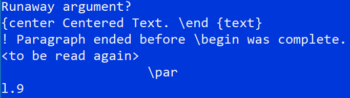

**Missing (or wrong) closing an environment.** In this case, we started the [Latex environment](https://www.overleaf.com/learn/latex/Environments) `center` with the command `\begin{center}`. Then, we forgot write `\end{center}` to close the environment `center`. The way to read the error below is: the environment center that was begun at line 6, was ended until `\end{document}` in line 10. This means that because Latex did not find `\end{center}`, it went straigth until finding the next `\end{}` command, which in this case was `\end{document}`; they don't match.

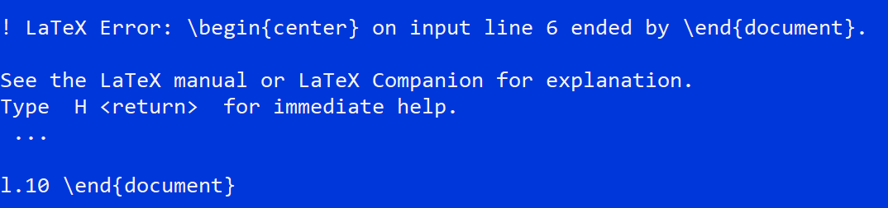

**Missing a Package** TBD.

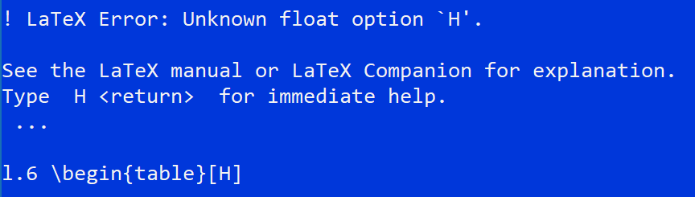

**Forgetting using the escape command "\" when using special Characters.** If you try to use [special characters](#special) as actual printed characters  and you forget to use the escape character, you will encounter these errors:

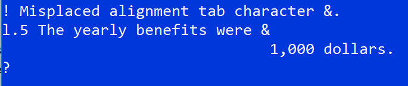
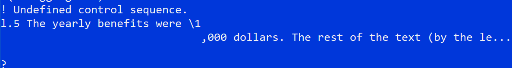
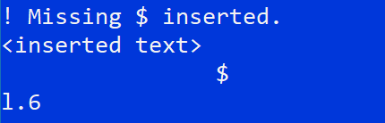
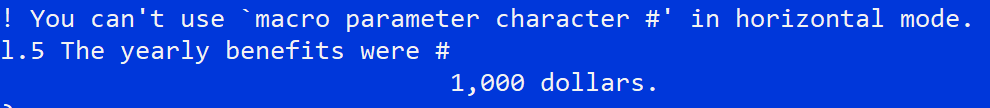
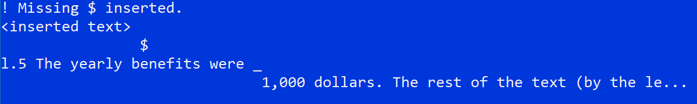

**Mispelled or wrong environment** We typed the `graphics` environment, which does not exist.

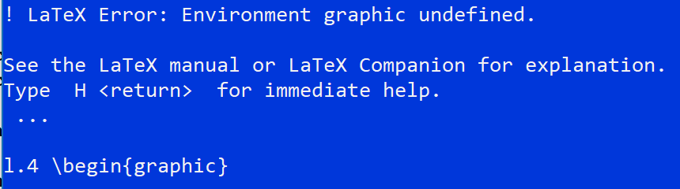

**Non-existing file** We wrote a `.tex` file that does not exist. This is a common error, often because the name of the file is misspelled and therefore Latex cannot find it.

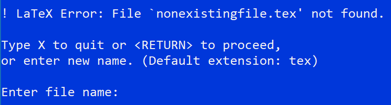

**Forgot to insert `\end{document}`** Another common mistake, but different than the one shown above about ending environments. When you forget to end the document, the compiler does not even show an error. It stops before running the preamble and body parts of Latex.

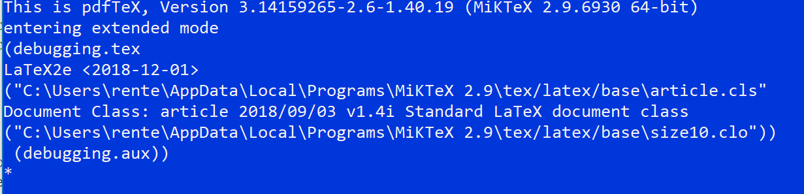

**Repeated critical commands (e.g. `\documentclass`)** When you type certain commands twice, you will get a warning but not a fatal error. There are some commands, however, that cannot be repeated. See below. *Note: if you installed one of the newest versions of markdoc you may encounter this problem because markdoc is going to write some Latex code without telling you.*

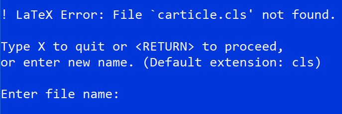

### Special Characters {#special}

This is very, very important as it is the most common bugs for novices. There are some "reserved" characters that Latex uses as commands for executing some markup. The special characters are:

- **\** : used to define the beginning of a command. For example, \input{}. It is also an "escape" symbol.
- **$** : used to mark the beginning of Math notation. When using it, you must use a second dollar sign to mark the end of Math notation.
- **%** : used to beginn comment text (same as * or // in Stata).
- **{}** : it has a couple of functions, mostly grouping characters for applying the same command (see the example of using underscore right below
- **_** : used to write underscript. For example the molecular formula of water would be H_{2}O. The {} symbols help applying the underscript only to the symbol 2, and not extend it to the symbol O. Underscripts and upperscripts must be used within the Math notation command (the dollar symbols explained above).
- **^** : used to write upperscripts with the same logics as underscripts.
- **\#** : Used as macro parameter

To print any of these symbols in your document, you must use the "escape" symbol "\". For example, if you want to write use the dollar symbol for actually talking about dollars, then you must type in the text:

```latex
The financial report that came yesterday shows that the company Renteria \& Ingram Co. had a yearly profit of \$165,000, which represents a 25\%.
```

Several ways to add vertical space: `\par` initiate a new paragraph. `\vspace{}` add vertical space (within curly brackets specify the space in inches; centimeters or points); `\smallskip`, `\medskip`, `\bigskip` all three add built-in vertical skips with different lenght; `//` equivalent to hit enter in Word.

### References
- [Overleaf Documentation](https://www.overleaf.com/learn)
- [Latex Wikibook](https://en.wikibooks.org/wiki/LaTeX)
- [The Not So Short Introduction to Latex](http://mirrors.rit.edu/CTAN/info/lshort/english/lshort-letter.pdf)
- http://math.hws.edu/gassert/LaTeX_Guide_Title.pdf
- https://www.deleidscheflesch.nl/assets/uploads/2017/09/instructions.pdf
- http://www.docs.is.ed.ac.uk/skills/documents/3722/3722-2014.pdf
- https://upload.wikimedia.org/wikipedia/commons/2/2d/LaTeX.pdf

[^1]: See [comparison of TeX Editors](https://en.wikipedia.org/wiki/Comparison_of_TeX_editors).
[^2]: This image and the explanation is taken from [Dickimaw's website](https://www.dickimaw-books.com/latex/novices/html/commonerrors.html).
