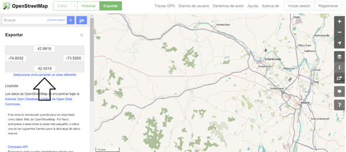
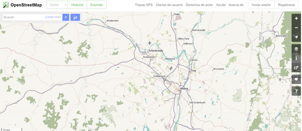
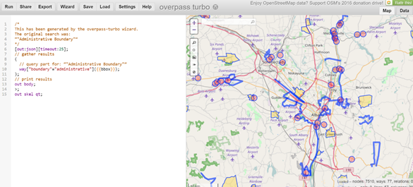
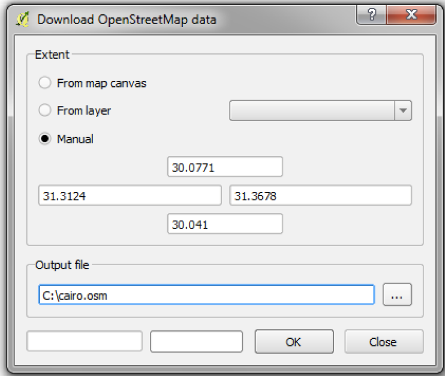
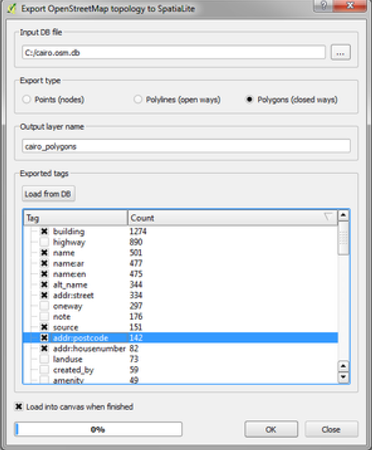

In this tutorial, I will intruce several ways to download data from OpenStreet Maps (OSM) into R. OSM is an open platform storing georeferenced data.[^1] The data in OSM is produced and managed by the people, and is freely available for visualization, query, download, and modification. OMS is especially useful for data at the city level.

A great feature of OSM maps is the tagging. OSMincludes a richer georeferenced dataset for social research than other commercial or governmental maps (for instance, you can find georeferenced items such as biking routes, pharmacy location, tree location, etc.)[^2]

This tutorial is divided in two parts. The [first part](), shows different ways to access data from OSM. The [second part], shows how to manage it into R.

## 1. Getting the Spatial Data

You can get the OSM data through the OSM’s Application Programming Interface (API) or through third party’s repositories. For the API, you can do it (at least) in four ways (which we will review):

- Manually
- Direct protocol
- Overpass Turbo
- QGIS.

If you need a small map (e.g. a city), probably the best ways to go are manually or with Overpass Turbo. If you need big maps (e.g. one or more countries), I’ll be more efficient to download it from data repositories.

### A. Manually

<u>Step 1.</u> Go to openstreetmaps.org, then place the map in the site from which you want to retrieve information.

<u>Step 2.</u> Click on “Export” on the left right corner. This is an interface to define the bounding box of the map you’re going to retrieve. The bounding box  is defined in the left part of the interface, where there are four numbers in a gray box (see the figure below). These numbers are the coordinates that set the limits of your personalized map. But you might want to have a better control of the map you want to retrieve. So, click on the option “manually select a different area” (see the arrow in the figure below).

This will show a shaded are which is the area that will not be considered in the retrieved map. This option will allow you to define the [bounding box](https://wiki.openstreetmap.org/wiki/Bounding_Box) either by dragging the corners that appear on the bright area in the screen or by defining the four numbers for the coordinates in the gray box.

Once you have the area, click on export and you will get a .osm file (the OSM’s native file format). With this alternative, you will be allowed to download a map with dimensions less than 0.25 x 0.25 coordinates. If your area is bigger than that, you cannot download it from OSM’s platform but you can still download it from third party in the options provided below the export button. Just to have a sense, a 0.25 x 0.25 range would cover this area:

### B. Direct protocol
Once you get familiar with the bounding box structure, you can download the data directly with this query:

> http://overpass-api.de/api/map?bbox=-73.9517,42.6198,-73.3969,42.7793

Once you hit this on your browser, the data will be downloaded immediately. This query system is extremely flexible and, with some additional skills, you can filter the data (e.g. retrieve a data set with only highways or administrative boundaries, etc.). This is also a very good idea when the limits 0.25 x 0.25 forces you to download two or more maps and then merge them.
The basic structure of the url above is:

> http://overpass-api.de/api/map?bbox=-[LEFT],[DOWN],[RIGHT],[UP]

Where **LEFT** is the coordinate at the left part of the gray box, **DOWN** is the coordinate number at the bottom of the gray box, and so on… Remember that with this option you’re also bounded to 0.25 x 0.25 map size.

## C. Overpass Turbo
[Overpass Turbo](https://overpass-turbo.eu/) is a very nice interface to do more refined queries without knowing too much about programming. In the figure below you will see that the interface is split in two parts. The left part guides the retrieving process, while the right part shows the results in map and data (see the tab “Data” in the upper right corner).

You don’t need to know how to program this, just click on the “Wizard” and type what you’re looking for. For instance, in the figure below, I first typed “administrative boundaries”, looking for the boundaries of municipalities, counties or whatever. Clicking on the wizard suggestion (“Did you mean: Administrative Boundary”) I ran the Query Wizard again and then I got the coding I needed (see below).

 
Once I get these programming lines, I click “Run” in the upper left part and the data will appear on the right side. Something important to have in mind when working with OSM is that they name nodes, ways, and relations to points, lines, and polygons. In the example provided, see that in the coding line number 10, it asks for “way”, which means that you’re retrieving lines. Since administrative boundaries are polygons, you might want to correct “way” for “relation” and click Run again to get the polygons. Also, see the gray box in the bottom right corner; it shows you the number of nodes, ways and relations that are within the bounding box observed.

Then click on "Export" to get the data. This comes in different flavors: GeoJSON, GPX, KML, and raw data (json). This is not in .osm format. All these files are manageable in R with the package rgdal,  but I found GeoJSON is the easiest to import in R. Downloading GeoJSON is slower and sometimes it seems that the website crashes, but be patient (if crashes, try multiple times). You might also want to save the query coding for future queries, so click Export-> Query -> as text. If you manage to learn the programming language behind OSM, you will be able to get much more personalized data.

## D. QGIS Interface
Overpass Turbo is nice, allows you to get bigger map, but still it crashes often with big maps. Thus, an alternative for big maps is retrieving maps QGIS. QGIS is an open source GIS software, and among other things it’s very useful for getting and managing OSM data. With this method, you’re still working with OSM’s API. The steps to follow are:

Step 1. Once you opened QGIS, click on Vector -> OpenStreetMap -> Download data. Now that you're familiar with the bounding box, just select "manual" and then type the coordinates of the personalized map you want to retrieve. Then select a name and location for your output file (is an .osm file).

Step 2. Click on Vector -> OpenStreetMap -> Import Topology from XML. In "Input XML file" place the .osm file you just have created. QGIS automatically will suggest you an output file name and location. Check the box "Create connection" and then click OK (keep the connection name suggested).

Step 3. Click on Vector -> OpenStreetMap -> "Export Topology to Spatial Lite". In the first field, insert the database you just have created in Step 2 (.osm.bd). In "Export type", select the type of layer you want: points, lines or polygons. The trick here is that the .osm file will have all of them; so, if you’re looking for highways, you will find this attribute in the layer lines. In the output layer name choose the name you want for your new GIS file. Then, click on "Load from DB". When you click here, you will see all the attributes available for either points, lines or polygons. Click on all the attributes you want to keep in your dataset. Then click OK and QGIS will display the map on the screen. The file will be exported as a SpatialLite file, but you can easily save it as Shapefile, GeoJSON, KML or whatever GIS file format that works better for you (see a file format comparison in Appendix 1).

## E. Repositories
All the options before are for small to medium maps. If you need to use regional maps (at national or international level), then you should get the data from repositories. There are many repositories and is easy to download the data.
The first place you may want to visit is http://extract.bbbike.org/. This is an interface similar than Overpass Turbo that allows you to get personalized data with bigger dimensions. You can also download the file directly as ESRI’s Shapefile. Another great site is https://www.geofabrik.de. Here you can find GIS files (Shapefiles and .osm) at different levels, from continents to states. You can check out the complete list of repositories here: http://wiki.openstreetmap.org/wiki/Planet.osm.

[^1]: [See more about OSM](https://www.e-education.psu.edu/geog585/node/738).
[^2]: See the [full catalog of features](http://wiki.openstreetmap.org/wiki/Map_Features).
